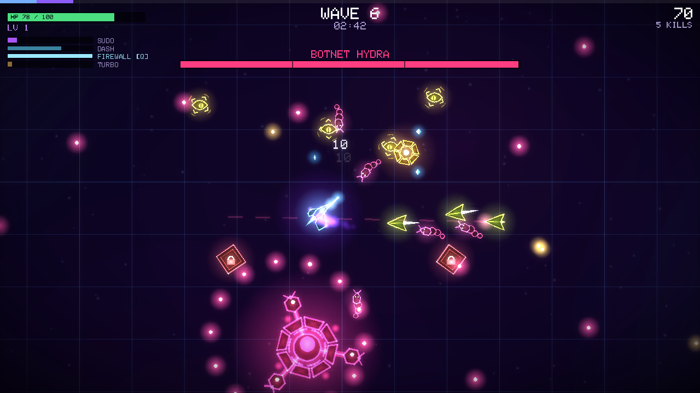
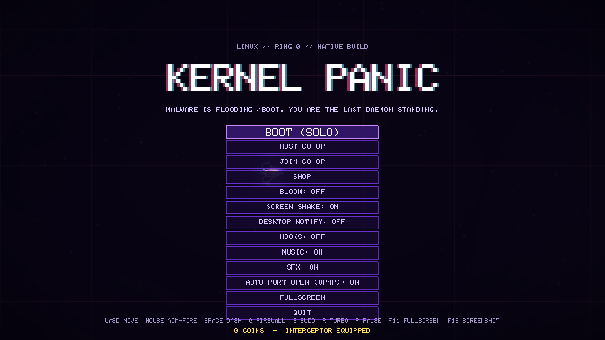
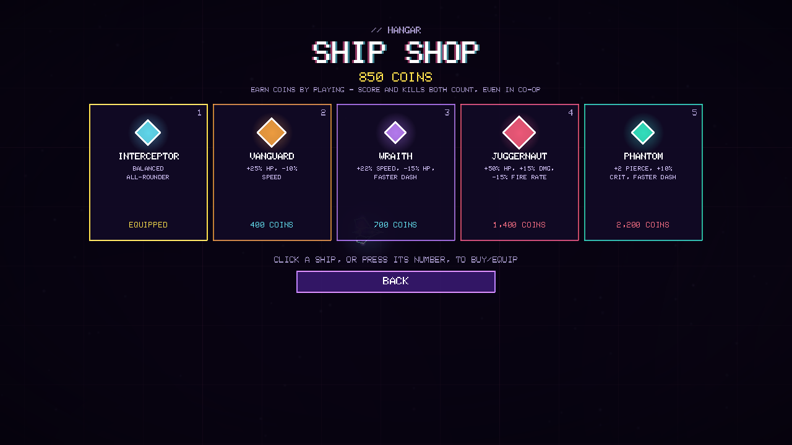
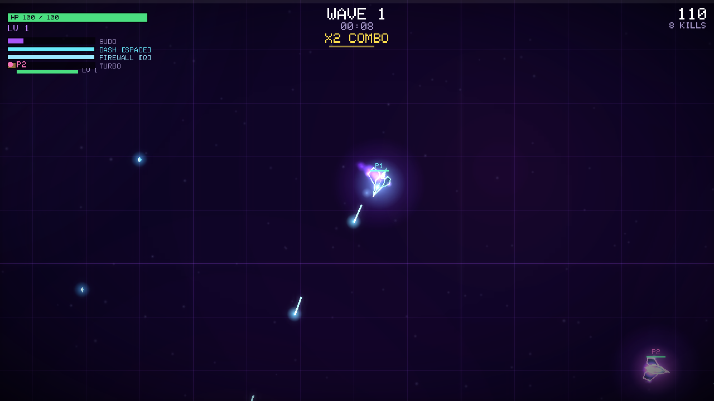

<p align="center">
  
</p>

<h1 align="center">KERNEL PANIC</h1>
<p align="center"><b>A neon twin-stick roguelite for Linux, with encrypted peer-to-peer co-op.</b></p>
<p align="center">C++17 + SDL2 + libsodium. No asset files — every graphic is vector-drawn and every sound is synthesized live. Native binary, no runtime, no telemetry.</p>

<p align="center">
  
</p>

Malware is flooding `/boot`. You're the last daemon standing. Survive escalating waves, pick from 20 upgrades as you level up, unlock two kill-charged special powers, and take on three bosses with distinct attack patterns — alone or with up to three friends, hosted with nothing but a single invite code.

## Screenshots

<table>
<tr>
<td></td>
<td></td>
</tr>
<tr>
<td align="center"><sub>Title screen</sub></td>
<td align="center"><sub>Ship shop</sub></td>
</tr>
<tr>
<td></td>
<td></td>
</tr>
<tr>
<td align="center"><sub>Co-op (each player's ship, HP and level shown live)</sub></td>
<td align="center"><sub>Wave 6, Botnet Hydra boss</sub></td>
</tr>
</table>

## Features

- **Twin-stick roguelite core** — dash, aim-and-shoot, level up mid-run, pick 1 of 3 upgrades each time from a pool of 20 (piercing, homing, orbiting blades, lightning chains, shockwaves, lifesteal, dodge, splash damage, and more).
- **Two active powers on top of the usual upgrades** — **Firewall** (`Q`), a personal shield on its own cooldown, and **Turbo** (`R`), a team-wide kill-charged buff separate from the sudo ultimate.
- **Three bosses** — Botnet Hydra, Zero-Day Exploit, Segfault — each with multiple phases and distinct bullet patterns.
- **Ships and coins** — every run earns coins from your score and kills. Spend them in the shop on 5 ships with different HP/speed/damage/size trade-offs.
- **Peer-to-peer co-op, up to 4 players, no server** — host a game, share one invite code, done. See [Multiplayer](#multiplayer) below.
- **Procedural everything** — no image or audio assets on disk; the ship, every enemy, every boss, the UI and the soundtrack are all generated by the program itself.
- **Desktop integration** — desktop notifications, a live JSON status file, and a hook system so external scripts can react to wave changes, bosses, and more. See [Outside the game](#outside-the-game).

## Install

Needs a C++17 compiler, SDL2, and libsodium. `libnotify` and `miniupnpc` are optional — desktop notifications and automatic router port-opening — the game runs fine without either.

```bash
# Gentoo
sudo emerge --ask media-libs/libsdl2 dev-libs/libsodium x11-libs/libnotify net-libs/miniupnpc
# Arch / Manjaro
sudo pacman -S --needed sdl2 libsodium libnotify miniupnpc base-devel
# Debian / Ubuntu / Mint / Pop!_OS
sudo apt install build-essential libsdl2-dev libsodium-dev libnotify-bin libminiupnpc-dev
# Fedora / Nobara
sudo dnf install gcc-c++ SDL2-devel libsodium-devel libnotify miniupnpc-devel
# openSUSE
sudo zypper install gcc-c++ libSDL2-devel libsodium-devel libnotify-tools miniupnpc-devel
```

Then clone and build:

```bash
git clone https://github.com/<your-username>/kernel-panic.git
cd kernel-panic
make            # builds ./kernel-panic
make test       # optional: runs the network/security test suite under AddressSanitizer + UBSan
make install    # installs to ~/.local: binary, app-menu entry with icon, default hooks
```

`kernel-panic` should now be in your app menu (right-click it for "Host a co-op game"), or run it directly:

```bash
~/.local/bin/kernel-panic
```

If it isn't found by name in a terminal, add `~/.local/bin` to your `PATH`:

```bash
echo 'export PATH="$HOME/.local/bin:$PATH"' >> ~/.bashrc
```

## Multiplayer

1. **Host:** title screen → **HOST CO-OP**. The lobby shows one invite code starting with `KP-`. Press **COPY INVITE** and send it.
2. **Friends:** **JOIN CO-OP**, paste the code (`Ctrl+V`), press Enter.
3. **Host:** press **START GAME** once everyone's in.

No server, no account, no port forwarding required in the common case — the invite carries the host's IPv6 address, a UPnP-opened port, and/or a STUN-discovered public address, and the joining game tries all of them. If none work, use a VPN like Tailscale, the same LAN, or forward the UDP port shown in the lobby by hand.

Every session gets a fresh random secret. The handshake uses an ephemeral X25519 key exchange (forward secrecy); every packet after that is authenticated and encrypted with XChaCha20-Poly1305. Unauthenticated traffic gets no reply and creates no state on the host — see the Makefile's `make test` target for the test suite that checks this (tampering, replay, 60k garbage packets, packet loss, typo detection in the invite code).

The invite code is effectively a password plus your address: only share it with people you trust, and note it changes every time you host. The host is authoritative and trusted by its clients, same as in any other co-op game.

## Controls

| | |
|---|---|
| Move | `WASD` |
| Aim / fire | Mouse, hold to fire |
| Dash | `Space` |
| Firewall (shield) | `Q` |
| Sudo (ultimate) | `E` |
| Turbo (team buff) | `R` |
| Menu / pause | `P` or `Esc` |
| Fullscreen | `F11` |
| Screenshot | `F12` |

Gamepad: left stick move, right stick aim + fire, `A` dash, `B`/`X` sudo, `Y` firewall, D-pad up turbo, `Start` menu. Level-up picks: click, `1`/`2`/`3`, or arrows + Enter.

## Outside the game

On events (start, wave, boss, boss defeated, sudo, level-up, game over, new high score) the game:

1. sends a desktop notification and flashes the taskbar if the window isn't focused,
2. writes `~/.cache/kernel-panic/live.json` (current wave, score, HP, color) for scripts and widgets,
3. runs `~/.config/kernel-panic/hooks/on_<event>` and `on_any`, with `KP_*` environment variables.

The default `on_any` hook recolors your [kitty](https://sw.kovidgoyal.net/kitty/) terminal to match the current wave. See `hooks/examples/` for a Mullvad-reconnect-on-boss hook, an OpenRGB hook, and a per-wave wallpaper hook. Best-score fastfetch snippet:

```jsonc
{ "type": "command", "key": "| Kernel Panic", "text": "cat ~/.local/share/kernel-panic/best.txt" }
```

## Options

```
--windowed / --fullscreen   --no-bloom   --no-notify   --no-hooks   --no-vsync
--host [--port N]           host a co-op game directly
--join KP-INVITE            join a co-op game with a pasted invite
```

Settings persist in `~/.config/kernel-panic/config.ini`.

## Troubleshooting

- **App-menu icon doesn't launch anything:** `make install` writes an absolute path into the launcher, so a fresh `make install` should fix this. Some menus cache entries and need a log out/in.
- **Crashes on launch:** run `~/.local/bin/kernel-panic` from a terminal to see the actual error. Try forcing a video backend: `SDL_VIDEODRIVER=x11 kernel-panic` or `SDL_VIDEODRIVER=wayland kernel-panic`.
- **No sound:** `SDL_AUDIODRIVER=pipewire kernel-panic` or `SDL_AUDIODRIVER=pulseaudio kernel-panic`.

## Known limits

No client-side movement prediction yet (co-op movement feels delayed on a high-latency link). Up to 4 players; nobody can join mid-run. Tested on loopback with simulated packet loss, not over real, varied internet paths.

## License

No license has been chosen yet for this repository — add a `LICENSE` file before treating this as open source in the legal sense (MIT is a common, permissive default for a project like this).
